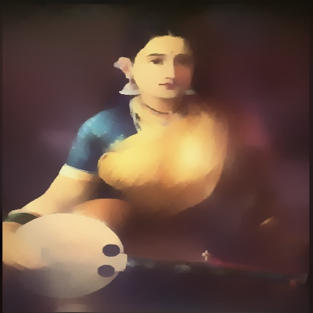
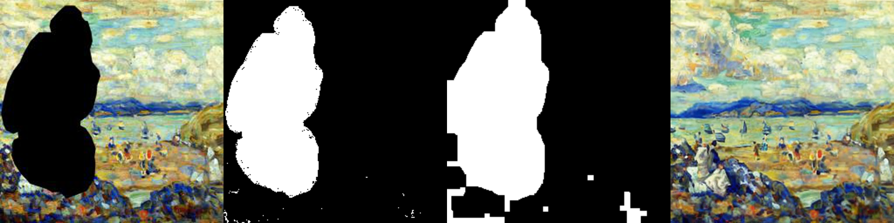
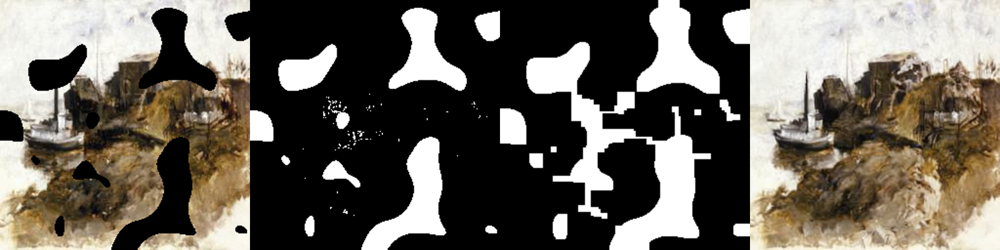
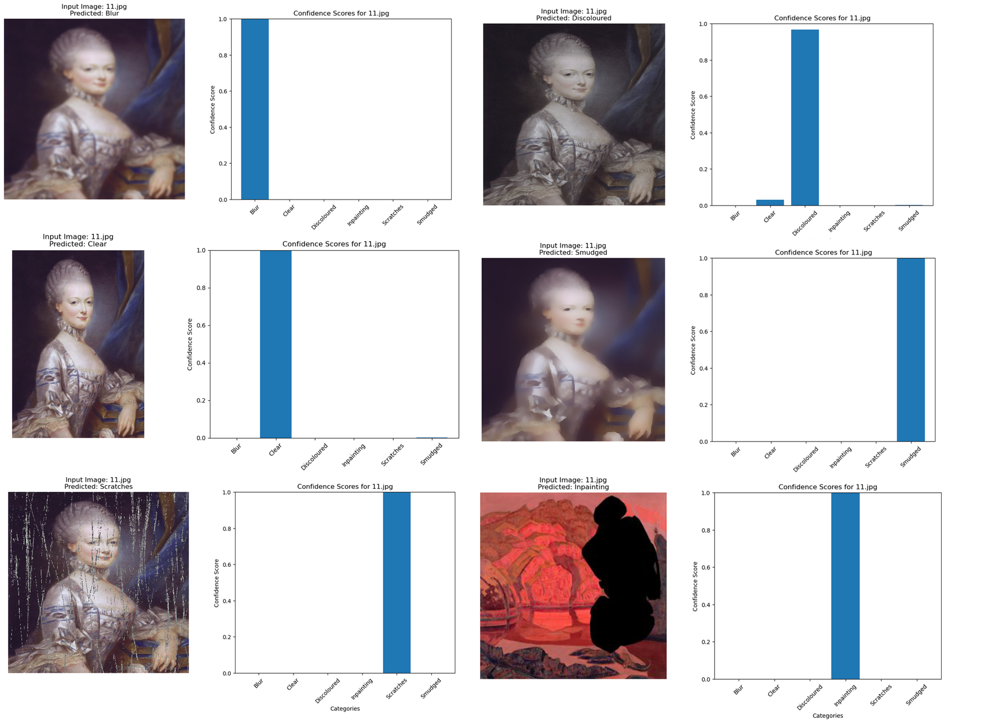

# ReArtify-AI

ReArtify-AI is an innovative tool designed to restore damaged paintings using cutting-edge machine learning techniques. It identifies the type of damage on an uploaded painting and applies specialized restoration processes to bring the artwork back to life.

## Key Features
- **Damage Classification**: 
  - Utilizes a self-trained Keras classifier to determine the type of damage, categorized as:
    - Missing areas
    - Scratches
    - Blur
    - Discoloration
    - Smudge
    - No damage
- **Damage-Specific Repair**: 
  - **Custom CNN Models**: Four specialized CNN models handle restoration based on the identified damage type:
    - Scratches
    - Blur
    - Discoloration
    - Smudging
  - **Missing Regions**: 
    - A custom mask generator combines detection, dilation, and erosion techniques to prepare damaged areas for repair.
    - Stability AI's **Stable Diffusion Inpainting 2.0** model restores missing regions with remarkable accuracy.

## Results

### Before and After Restoration
Below is an example of a damaged painting repaired using ReArtify-AI:

<div align= "center">
  <table style="margin: auto;">
    <tr>
      <th>Damaged Input</th>
      <th>Restored Output</th>
    </tr>
    <tr>
      <td></td>
      <td></td>
    </tr>
    <tr>
      <td></td>
      <td></td>
    </tr>
    <tr>
      <td></td>
      <td></td>
    </tr>
    <tr>
      <td></td>
      <td></td>
    </tr>
  </table>
</div>
---

### Process Example
1. **Uploaded Image**: The input painting was analyzed to determine the damage type.
2. **Damage Classification**: The classifier identified the damage correctly
3. **Repair**: The corresponding CNN model repaired the image with the displayed results.

## Inpainting Results

The grid below showcases the results of the inpainting process, where missing regions in the damaged painting are restored using **Stable Diffusion Inpainting 2.0**.

<div align="center">
  
  
</div>

---

### Explanation
1. **Input Image**: The damaged painting with missing regions, representation of missing reigon given by user through the UI. Any part the user determines to be missing, they can cover in color #ffffff through the UI.
2. **Mask Generation**: A basic mask is created representing the areas of the painting with color **#ffffff**
3. **Mask Processing**: The mask is then passed through a dynamic dilation and erosion algorithm, allowing area outside the missing area to be covered. This is done to give the model context about the painting it's supposed to inpaint.
4. **Restoration**: Missing regions are restored with fine detail using the inpainting model.

### Observations
- **Model Used**: Stability AI's **Stable Diffusion Inpainting 2.0**.
- **Result Accuracy**: The restored regions blend seamlessly with the surrounding image.
## Evaluations
### CNN models
Evaluations of the quality were carried out via 4 metrics: PSNR, FID, SSIM, MSE, for an overall view of the model's quality performance.
<div align="center">
  <table style="margin: auto; text-align: center;">
    <tr>
      <th>Model</th>
      <th>PSNR</th>
      <th>FID</th>
      <th>SSIM</th>
      <th>MSE</th>
    </tr>
    <tr>
      <td>Blur</td>
      <td>20.93</td>
      <td>31.53</td>
      <td>0.613</td>
      <td>0.011</td>
    </tr>
    <tr>
      <td>Discolored</td>
      <td>23.52</td>
      <td>10.07</td>
      <td>0.775</td>
      <td>0.005</td>
    </tr>
    <tr>
      <td>Scratches</td>
      <td>25.21</td>
      <td>14.49</td>
      <td>0.861</td>
      <td>0.004</td>
    </tr>
    <tr>
      <td>Smudged</td>
      <td>19.65</td>
      <td>14.53</td>
      <td>0.601</td>
      <td>0.011</td>
    </tr>
  </table>
</div>

### Keras Classifier
We plotted the confidence scores for multiple damage types, and checked accuracy, precision, recall, F1 score, and plotted a confusion matrix.
During our training the best model achieved an accuracy of **0.9822** and the L1 loss came to be **0.046**
<div align="center">
  
</div>

## Installation and Setup
To reduce repository size:
1. **Frontend Dependencies**:
   - The `node_modules` folder has been removed.
   - Install necessary frontend dependencies using:
     ```bash
     cd frontend
     npm install
     ```
2. **Stable Diffusion Inpainting Model**:
   - The Stability AI inpainting model is not included in this repository.
   - Download the model and place it in the `models/inpainting` folder.
   - Use the provided download script:
     ```
     models/backup-models-and-codes/inpainting-model-downloader.ipynb
     ```

## Usage
1. Run the project using: Launch.bat
2. Follow the on-screen instructions to upload a damaged painting and view the restoration results.
## Dependencies
- **Frontend**: Install modules using `package.json`.
- **Backend and Models**:
- Keras for damage classification.
- Stability AI's Stable Diffusion Inpainting 2.0 for missing regions.
- Custom CNN models for specific damage types.

## How It Works
1. **Upload Painting**: Users upload an image of the damaged painting.
2. **Classification**: The Keras classifier identifies the type of damage.
3. **Restoration**:
- If the damage is scratches, blur, discoloration, or smudging, the corresponding CNN model repairs the image.
- For missing areas, the mask generator prepares the image, and the inpainting model restores the regions.
4. **Result**: The restored painting is displayed or saved.

## Notes
- Ensure that the inpainting model and dependencies are properly set up before running the application.
- Refer to the download script for obtaining required external models.

## Future Enhancements
- Improved damage classification for multi-type damages.
- Additional models to address new types of painting damage.
- Enhanced user interface for better accessibility.

---

We hope you enjoy using ReArtify-AI to bring damaged artwork back to life! 😊
